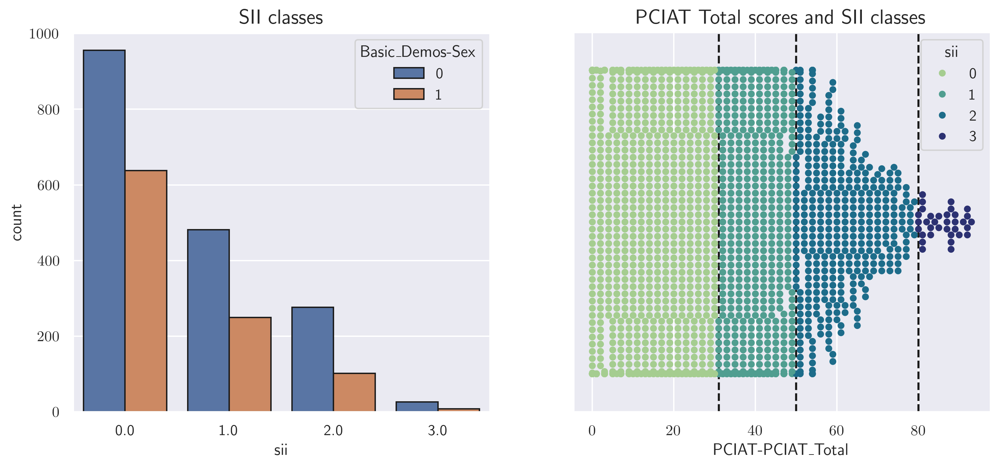

With the rise in the number and usage of social media, it has become imperative to identify *problematic internet usage* among children and young adults. This repository contains analysis based on a Kaggle competition initiated by the *Child Mind Institute* for detecting such problematic internet usage.

The train and test dataset are of two types - ```.csv``` files containing a table of $82$ attributes of  and ```.parquet``` files containing additional actigraphy information on select participants. The attributes in the ```train.csv``` and ```test.csv``` files are described in the metadata ```data_dictionary.csv``` file and can be broadly divided into the following categories

* Demographic
* Physical
* Fitness and Vitals
* Bio-electric Impedence Analysis
* Internet-Addiction Test
* Sleep Disturbance
* Internet Usage

The purpose of this task is to predict the 'sii index', measuring the severity of problematic internet usage. The ```train.csv``` file contains $3820$ unique participants, labeled using an identifier. However, $1224$ of the entries do no have an associated ```sii``` score, making this a semi-supervised learning problem.
## Initial data processing
The time-series files can contain important information regarding the participants' movements and habits during different times of the day. These are calculated using the ```extract_timeseries_features()``` function. This function breaks down each day into morning, afternoon, evening and night time periods and calculatates, among other things, movement (during day and sleep), sleep disruption, light exposure at different hours and physical activity. 
