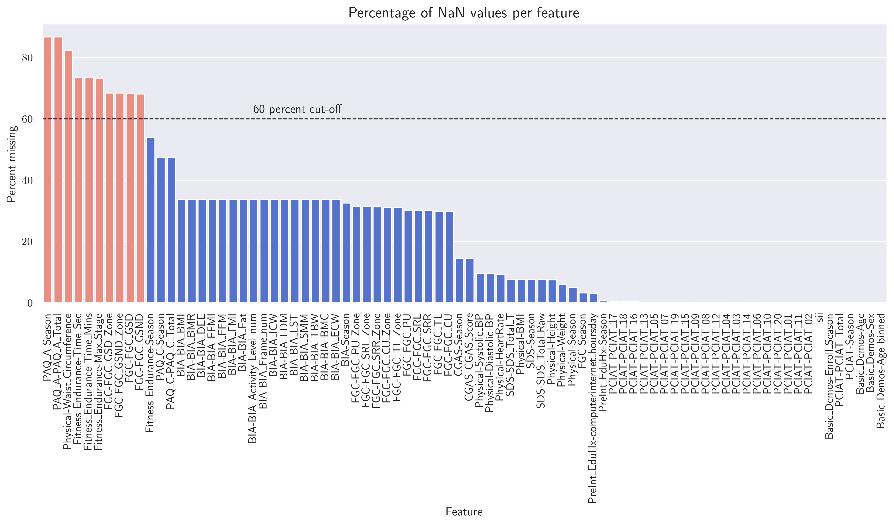
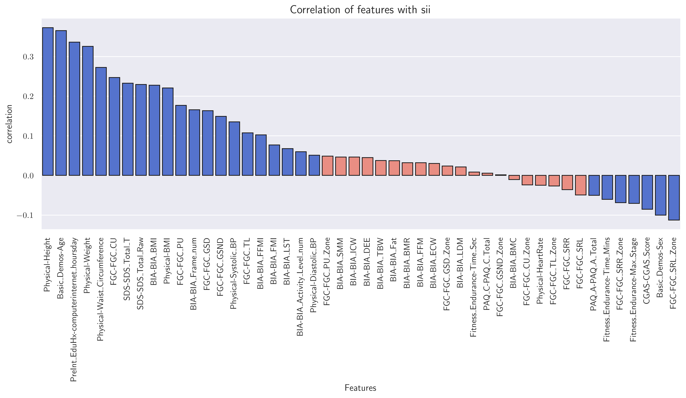
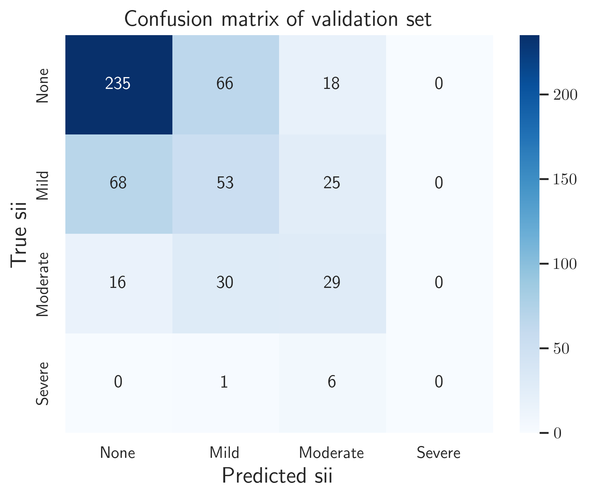

 # Problematic Internet Usage among children and adolescents: a semi-supervised learning approach

With the rise in the number and usage of social media, it has become imperative to identify *problematic internet usage* among children and young adults. This repository contains analysis based on a Kaggle competition initiated by the *Child Mind Institute* for detecting such problematic internet usage.

The train and test dataset are of two types - ```.csv``` files containing a table of $82$ attributes of  and ```.parquet``` files containing additional actigraphy information on select participants. The attributes in the ```train.csv``` and ```test.csv``` files are described in the metadata ```data_dictionary.csv``` file and can be broadly divided into the following categories

* Demographic
* Physical
* Fitness and Vitals
* Bio-electric Impedence Analysis
* Internet-Addiction Test
* Sleep Disturbance
* Internet Usage

The purpose of this task is to predict the 'severity impairment index' (```sii```), measuring the severity of problematic internet usage. The ```train.csv``` file contains $3820$ unique participants, labeled using an identifier. However, $1224$ of the entries do no have an associated ```sii``` score, making this a semi-supervised learning problem.
## Initial data processing
The time-series files can contain important information regarding the participants' movements and habits during different times of the day. These are calculated using the ```extract_timeseries_features()``` function. This function breaks down each day into morning, afternoon, evening and night time periods and calculatates, among other things, movement (during day and sleep), sleep disruption, light exposure at different hours and physical activity. These additional actigraphy features are extracted using the ```timeseries_features_df()``` function (using parallel processing) and merged with the ```.csv``` files. 

The data and time-series feature dataframes are merged. Since only a subset of the data contains ```sii``` labels, we perform supervised learning on that subset. The ```sii``` is actually derived from the ```PCIAT-Total``` test scores of the participants. Hence, there is a direct correspondence between the availability of ```PCIAT``` and ```sii``` values. The way the ```sii``` scores are determined is as follows
* $0 - 30$: ```sii=0``` (no impairment)
* $31 - 49$: ```sii=1``` (mild impairment)
* $50 - 79$: ```sii=2``` (moderate impairment)
* $80 - 100$: ```sii=3``` (severe impairment)

The plots below show the distributions of the ```sii``` and ```PCIAT``` scores for the participants. One immediately observes that the dataset is highly imbalanced.


The dataset provided is far from complete and contains a large number of missing (NaN) entries. While imputation is important, there are those features with over $80\%$ of the entries missing. In such cases imputation will be ill-advised. Such features are excluded from the dataset. Furthermore, we also exclude those features that show very low correlation with ```sii```. 
```math
0.05 \geq \text{Corr}(X_i) \geq - 0.05
```




Finally, we include a few more features created out of existing ones. Overall, with the different features excluded, we arrive at $69$ numerical and $7$ categorical features after the initial round of processing. These columns are saved in the ```final_features``` folder.
## Evaluation metric
In many cases, such as surveys used by healthcare practitioners, using metrics such as accuracy or $F_1$ scores might not be very feasible. This might arise due to several reasons, important ones being
* class imbalance
* interpretability of accuracy

In such cases, one of the most effective ways to testing results of such clinical surveys is to use the *Cohen's kappa* ($\kappa$), which measures reliability of two raters, by comparing the agreements in the observed results to those expected by random chance. The interpretations of $\kappa$ are as follows
* $\kappa < 0$: poor agreement
* $0\leq\kappa\leq0.2$: slight agreement
* $0.20 < \kappa \leq 0.4$: fair agreement
* $0.40 < \kappa \leq 0.6$: moderate agreement
* $0.80 < \kappa \leq 0.80$: substantial agreement
* $\kappa > 0.80$: almost perfect agreement

Here, we use the quadratically weighted kappa as the preferred evaluation metric. Details on the Cohen's kappa can be found in the ```cohens_kappa.pdf``` file.
## Training and validation
The data with the chosen features were further processed through a pipeline which included winsorization, imputation and scaling. For training and validation, we used three different boosted tree methods - (i) XGBoost, LightGBM and CatBoost with a final voting ensemble with the three boosted trees. We performed hyperparameter optimization using the ```optuna``` library and the optimized parameters can be found in the ```model_hyperparameters``` folder. Even through the ```sii``` variable is ordinal, the data is trained on boosted trees with an optimized threshold rounder to arrive at a final integer result. The validation result can be summarized using the following confusion matrix 
 
 with a kappa score of $0.464$, indicating moderate inter-rater reliability. Since the data is so heavily imbalanced, the model performs poorly for 'moderate' and 'severe' cases, with no correct 'severe' classification being made.